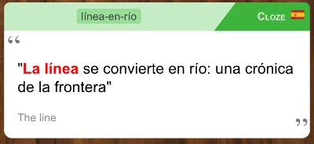
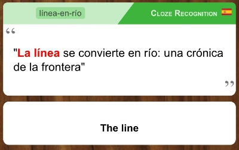

# Description

Anki download ID: 928791899

An Anki add-on to generate "recognition" cloze cards based on normal "production" cloze cards.
It uses the "production" cloze notes' hint fields like the answer side of a Basic card.

It keeps the recognition cards in sync with any changes to the production cards.

This is useful when you want to use cloze notes, but you want "reverse cloze" too, to study
both directions (eg, in language-learning where you want to learn both English-to-Spanish and
also Spanish-to-English).

# Usage

1. Install the add-on and restart Anki.
2. The add-on runs automatically at startup; it will initially report no notes to update.
3. **Create a new Note, of type "Cloze (and recognition card)".**
4. LEAVE THE TWO ID FIELDS AT THE END OF THE NOTE ALONE.
   - Fields "RecognitionClozeProductionId" and "RecognitionClozeRecognitionId" are filled in automatically by the add-on.
   - These IDs are like "links" between the pair of related notes. If you change them, the add-on won't be able to find the cards.
5. Save the note.
6. Go to the deck list overview screen.
7. Select menu item "Tools" > "**Update recognition cloze cards**".

# Screenshots

_(The specific styling in the screenshots below comes from
[my personal Anki setup](https://github.com/Arthaey/anki-personal).)_

# Normal "production" cloze cards
## Front side

## Back side

# New "recognition" cloze cards
## Front side

## Back side

# Support

Post a [new issue on Github](https://github.com/Arthaey/anki-cloze-recognition/issues/new)
(or make a pull request!). You can also write a review or ask questions on the
[Anki website for shared add-ons](https://ankiweb.net/shared/info/928791899).

[My other Anki add-ons](https://github.com/search?q=user%3AArthaey+anki)
are also on Github.

# License

This addon is licensed under the same license as Anki itself
(GNU Affero General Public License 3).
